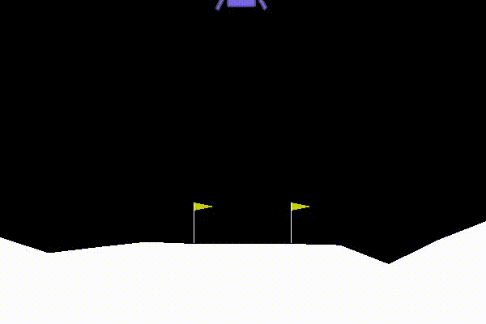
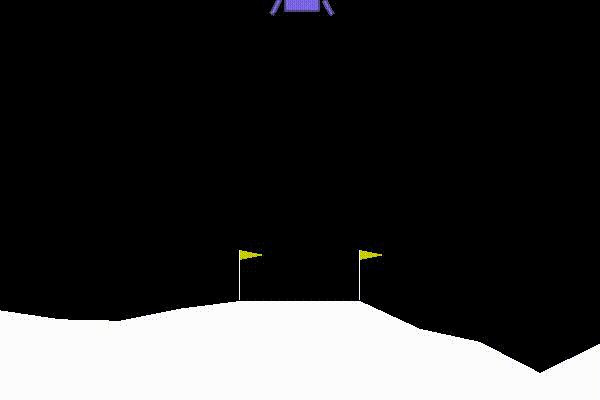
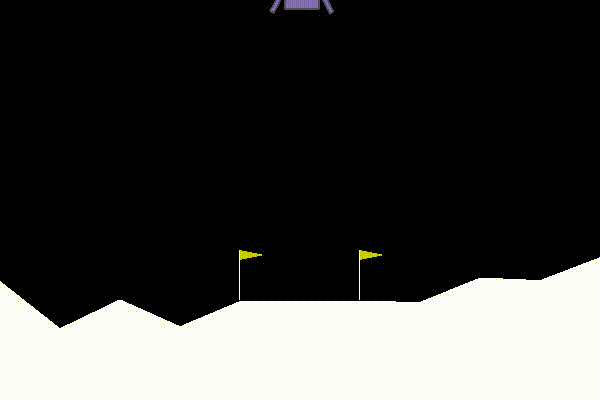
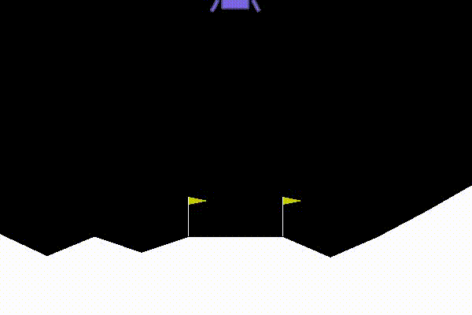

# Deep Reinforcement Learning on OpenAI Gym environment 

<!--  -->
  
Source [1]

Table of contents
=================
<!--ts-->
   * [Abstract](#abstract)
   * [Architecture](#architecture)
   * [Implementation](#implementation)
   * [Evaluation](#evaluation)
   * [Result](#result)
   * [References](#references)
<!--       * [STDIN](#stdin)
      * [Local files](#local-files) -->

## Abstract
Reinforcement learning is a subset of Machine learnig and is seen as a decision-making task that has components of control theory as well.
The basic idea is based on  the psychocological and neurospecific behavior of how animals react to a certain environment. An "Agent" is similar in that sense and tries to make enough representation of the environment given to them, their goal being, learning from the past experiences and improving the new experiences. In this project, using a deep neural network, an agent is created who's name is "deep-Q-network" that effectively learns from its environment using the high dimension input images and deploying end-to-end reinforcement learning. The test is performed on the OpenAI games to visualise the agent's performance over the period of time in terms of scores.

 
Image reference: Galatzer-Levy, Isaac & Ruggles, Kelly & Chen, Zhe. (2018). Data Science in the Research Domain Criteria Era: Relevance of Machine Learning to the Study of Stress Pathology, Recovery, and Resilience. 

--------------

## Architecture
The architecture of this project involves two models: 
1) Q CNN (A convolutional Neural Network similar to the one implemented in the paper referenced above for action-value function Q)
2) Q_hat CNN (similar model as Q CNN  for target action-value function Q_hat)

The CNN has total 6 layers:
1) 3 Convolutional 2D layers
2) 3 Dense layers
The final layer outputs "Action-values"( Being in a state s, if we take action a how much will be the total reward)

--------------

## Implementation

1) The implementation is done using the Keras API of tensor flow(for approximating the Q value_function).
2) OpenAI gym is used for creating the environment of different Atari games and getting the observation space and action space values.
3) The mathematical flow of this project is exactly like the one implemented in the paper which is as given below:
## Mathematical Reference from the paper
 

--------------

## Description

1) The main idea of this project is to combine the reinforcement learning with deep neural network to train the D-Q-N agent.
2) The two neural networks implemented in this project are used to approximate the q tables, for action-value function Q and target action_value function Q_hat
3) Q_hat is the initial target policy, while Q is the running policy which gets updated and evaluates the initial policy Q_hat over many iterations.
4) In this program, I am updating the Q_hat every C steps making it equal to Q
5) The current policy Q now again starts updating based on updated Q_hat.
6) This process goes on for many iterations.
7) An episode is the time steps required by the agent from the initial state to the final state (final state being success or failure)
8) Now the process begins when the agent will make an action based on some initial Q_hat. The agent starts from an initial state S1. This state is acquired by resetting the gaming environment (example: LunarLander-v2)
9) Now the agent faces a dilemna. Good approach to solve this dilemna: To follow a some policy, but also have high probability for exploration.
Over the period of time, as the agent keeps learning, and tries to converge to near optimal policy, we will decrease this probability of choosing random action, and we will choose actions that are sampled from the replay memory(past experiences of the agent)
10)  This makes the agent greedy over time
11)  After we acquire an action from the previous step, we will use it in the gym environment and get the transition( current state, next state, reward, done)
12)  For training our agent we will randomly sample a fixed sized batch from replay memory.
13)  Now that we have sampled some past experiences, we will use Q_hat to calculate reward for all the sampled current states sj
We select a maximum action value from next state
If it’s a terminal state, the future reward = 0 which makes it just rj
1)  With this new reward we just calculated for all sj, we will update our running policy Q network, with the new action values using gradient descent and back propogation
2)  In my implementation I am updating the running policy Q every 4 timesteps and the target network Q_hat every C timesteps
This delayed update is mainly because, the current Q network value does not change drastically over consecutive iterations.

--------------

## Evaluation

The evaluation is done based on the improvement in the score of earned by the agent playing different games in Atari2600 which is shown as below:

### Agent gradually performing better:

 

 

 

--------------

## Result

The plot of Mean Reward against number of episodes:

 

--------------
## Conclusion
Therefor, updating the current Q network can be seen as policy evaluation step in reinforcement learning
And updating the target Q_hat network which is my target network policy can be seen as policy improvement step of reinforcement learning.

--------------

## References  
#### [1] Mnih, V., Kavukcuoglu, K., Silver, D., Graves, A., Antonoglou, I., Wierstra, D., & Riedmiller, M. (2013). Playing atari with deep reinforcement learning. arXiv preprint arXiv:1312.5602.
--------------
